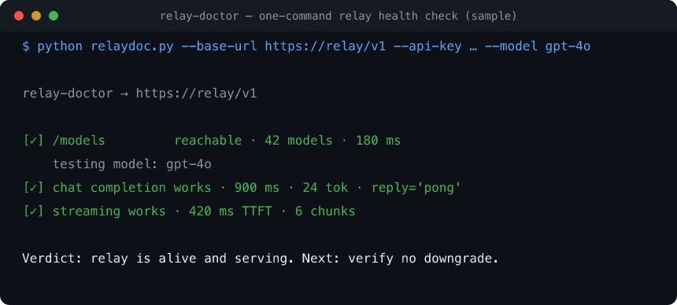

# relay-doctor

**One command to health-check any OpenAI-compatible AI API / relay. Zero
dependencies — Python 3 stdlib only. Your key never leaves your machine.**

The quick smoke test you run *before* trusting a relay. (For the deep "am I being
silently model-downgraded?" check, use [cocodot-llmprobe](https://github.com/cocodot2026/cocodot-llmprobe).)

> **Prefer a browser?** The deep downgrade check also runs online — no install:
> **[probe.cocodot.co](https://probe.cocodot.co)** (free, keys are never stored, same open methodology).



## ⚡ 60-second quickstart

```bash
# no install, no deps — just Python 3
curl -O https://raw.githubusercontent.com/cocodot2026/relay-doctor/main/relaydoc.py
python relaydoc.py --base-url https://<relay>/v1 --api-key <key> --model <id>
```

**Or run it with zero install** (via [pipx](https://pipx.pypa.io/)):
```bash
pipx run --spec git+https://github.com/cocodot2026/relay-doctor.git relay-doctor
```
One command → reachable? which models? does a completion work? streaming? latency.


## What it checks
1. **/models** — endpoint reachable? how many models exposed?
2. **chat completion** — does a real call succeed? round-trip latency, token usage,
   and whether the reported `model` matches what you asked for.
3. **streaming** — does streaming work? time-to-first-token (TTFT).

## Use
```bash
python relaydoc.py --base-url https://<relay>/v1 --api-key <key>
python relaydoc.py --base-url https://<relay>/v1 --api-key <key> --model gpt-4o
# also reads OPENAI_BASE_URL / OPENAI_API_KEY
```

Sample verdict:
```
[✓] /models         reachable · 42 models · 180 ms
    testing model: gpt-4o
[✓] chat completion works · 900 ms · 24 tok · reply='pong'
[✓] streaming works · 420 ms TTFT · 6 chunks
Verdict: relay is alive and serving. Next: verify it's not downgrading → LLMprobe.
```

## Where it fits
A small honest toolkit for running AI from China:
[relay-doctor](https://github.com/cocodot2026/relay-doctor) (is it alive?) →
[cocodot-llmprobe](https://github.com/cocodot2026/cocodot-llmprobe) (real model?) →
[ai-api-cost](https://github.com/cocodot2026/ai-api-cost) (what will it cost?) →
[ai-coding-from-china](https://github.com/cocodot2026/ai-coding-from-china) (wire it into Claude Code / Cursor).

The author builds [cocodot](https://cocodot.co?utm_source=github&utm_medium=readme&utm_campaign=relay-doctor), a relay — disclosed; this tool
works against **any** endpoint, cocodot included. MIT.
